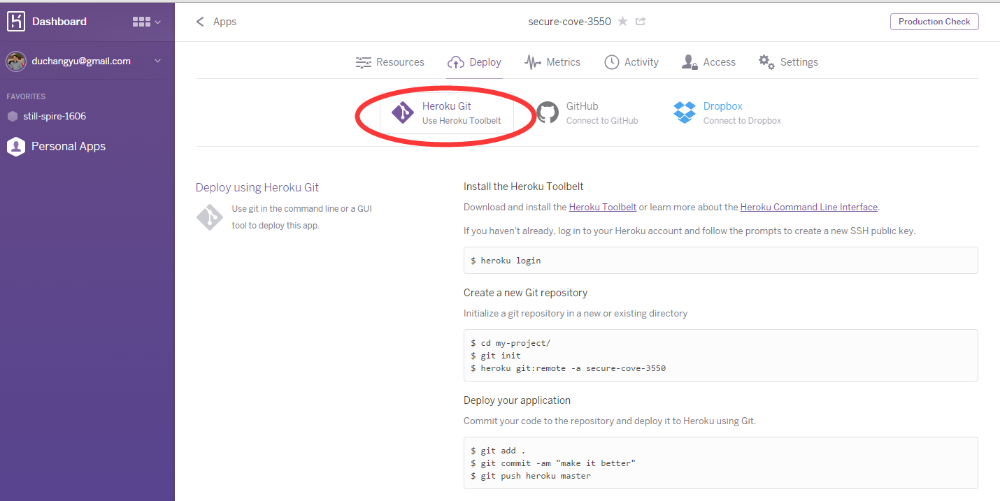

# Appendix C: Deploy on the web

In this workshop, you developed your web service on the local machine (i.e. http://localhost/) which means that only yourself and people 
on the same network can eventually access your web site using your ip address.

For example, you can use http://localhost/ or http://127.0.0.1/ to access your machine web site (127.0.0.1 is the default address for your network card),
and other people should use the real ip address instead (usually something like http://192.168.1.55/). Running a web site on the local machine is only 
required for development purprose, but you may want to make the web site available to anyone in the world. To do this you need to deploy your web site 
on a web server.

A very easy way to do this is to use ['heroku'](https://www.heroku.com/) which has a nice feature to a web site deploy from github.

<b>Step 1</b> Sign up on [heroku.com](https://www.heroku.com/) for a free account

<b>Step 2</b> Create a node.js server by selecting the '+' sign on the top-right corner

 
 
<b>Step 3</b> Push the 'Create App' button. You can leave the name field empty, and use the location you prefer.

 
 
<b>Step 4</b> By default, heroku will show the 'Deploy' page, if not, select 'Deploy'

 
 
<b>Step 5</b> Next, select 'Heroku Git - Use Heroku toolbet'

 

As described in the web page, you need to install the Heroku Toolbelt, you can download and install the [Heroku Toolbelt](https://toolbelt.heroku.com/) or learn more about the [Heroku Command Line Interface](https://devcenter.heroku.com/categories/command-line).

If you haven't already, log in to your Heroku account and follow the prompts to create a new SSH public key.
```
$ heroku login
Enter your Heroku credentials.
Email: <your heroku account here>
Password (typing will be hidden): 
Authentication successful.

```
Create a new Heroku app through command line, it will create an app with random name if you do not give one in command line, it also add a git remote to Heroku so that you can deploy your code by git push:
```
$ heroku create
Creating quiet-shore-6917... done, stack is cedar-14
https://quiet-shore-6917.herokuapp.com/ | https://git.heroku.com/quiet-shore-6917.git
Git remote heroku added

```


Commit your code to the repository.

```
$ git add .
$ git commit -am 'a running version'

````


Now deploy your website to Heroku using Git once your are ready. Heroku will detect your app and setup the corresponding hosting environment, and then host it for you. 

```
$ git push heroku master
Counting objects: 116, done.
Delta compression using up to 4 threads.
Compressing objects: 100% (61/61), done.
Writing objects: 100% (116/116), 142.69 KiB | 0 bytes/s, done.
Total 116 (delta 63), reused 99 (delta 50)
remote: Compressing source files... done.
remote: Building source:
remote: 
remote: -----> Node.js app detected
remote: 
remote: -----> Reading application state
remote:        package.json...
remote:        build directory...
remote:        cache directory...
remote:        environment variables...
remote: 
remote:        Node engine:         unspecified
remote:        Npm engine:          unspecified
remote:        Start mechanism:     server.js
remote:        node_modules source: package.json
remote:        node_modules cached: false
remote: 
remote:        NPM_CONFIG_PRODUCTION=true
remote:        NODE_MODULES_CACHE=true
remote: 
remote: -----> Installing binaries
remote:        Resolving node version (latest stable) via semver.io...
remote:        Downloading and installing node 0.12.2...
remote:        Using default npm version: 2.7.4
remote: 
remote: -----> Building dependencies
remote:        Installing node modules
remote:        npm WARN package.json AdnViewerBasic@0.0.0 No description
remote:        npm WARN package.json AdnViewerBasic@0.0.0 No repository field.
remote:        caseless@0.10.0 node_modules/caseless
remote:        
remote:        json-stringify-safe@5.0.0 node_modules/json-stringify-safe
remote:        
remote:        aws-sign2@0.5.0 node_modules/aws-sign2
remote:        
remote:        forever-agent@0.6.1 node_modules/forever-agent
remote:        
remote:        stringstream@0.0.4 node_modules/stringstream
remote:        
remote:        oauth-sign@0.7.0 node_modules/oauth-sign
remote:        
remote:        tunnel-agent@0.4.0 node_modules/tunnel-agent
remote:        
remote:        isstream@0.1.2 node_modules/isstream
remote:        
remote:        node-uuid@1.4.3 node_modules/node-uuid
remote:        
remote:        qs@2.4.1 node_modules/qs
remote:        
remote:        combined-stream@0.0.7 node_modules/combined-stream
remote:        └── delayed-stream@0.0.5
remote:        
remote:        form-data@0.2.0 node_modules/form-data
remote:        └── async@0.9.0
remote:        
remote:        mime-types@2.0.11 node_modules/mime-types
remote:        └── mime-db@1.9.1
remote:        
remote:        router@1.1.0 node_modules/router
remote:        ├── setprototypeof@1.0.0
remote:        ├── array-flatten@1.0.2
remote:        ├── utils-merge@1.0.0
remote:        ├── methods@1.1.1
remote:        ├── parseurl@1.3.0
remote:        ├── path-to-regexp@0.1.3
remote:        └── debug@2.1.3 (ms@0.7.0)
remote:        
remote:        http-signature@0.11.0 node_modules/http-signature
remote:        ├── assert-plus@0.1.5
remote:        ├── asn1@0.1.11
remote:        └── ctype@0.5.3
remote:        
remote:        bl@0.9.4 node_modules/bl
remote:        └── readable-stream@1.0.33 (isarray@0.0.1, inherits@2.0.1, string_decoder@0.10.31, core-util-is@1.0.1)
remote:        
remote:        combine-stream@0.0.4 node_modules/combine-stream
remote:        └── readable-stream@1.1.13 (isarray@0.0.1, inherits@2.0.1, string_decoder@0.10.31, core-util-is@1.0.1)
remote:        
remote:        serve-favicon@2.2.0 node_modules/serve-favicon
remote:        ├── ms@0.7.0
remote:        ├── fresh@0.2.4
remote:        ├── parseurl@1.3.0
remote:        └── etag@1.5.1 (crc@3.2.1)
remote:        
remote:        request@2.55.0 node_modules/request
remote:        ├── caseless@0.9.0
remote:        ├── oauth-sign@0.6.0
remote:        └── http-signature@0.10.1 (assert-plus@0.1.5, asn1@0.1.11, ctype@0.5.3)
remote:        
remote:        express@4.12.3 node_modules/express
remote:        ├── merge-descriptors@1.0.0
remote:        ├── utils-merge@1.0.0
remote:        ├── methods@1.1.1
remote:        ├── fresh@0.2.4
remote:        ├── cookie-signature@1.0.6
remote:        ├── cookie@0.1.2
remote:        ├── escape-html@1.0.1
remote:        ├── range-parser@1.0.2
remote:        ├── parseurl@1.3.0
remote:        ├── content-type@1.0.1
remote:        ├── finalhandler@0.3.4
remote:        ├── vary@1.0.0
remote:        ├── serve-static@1.9.2
remote:        ├── content-disposition@0.5.0
remote:        ├── path-to-regexp@0.1.3
remote:        ├── depd@1.0.1
remote:        ├── debug@2.1.3 (ms@0.7.0)
remote:        ├── on-finished@2.2.1 (ee-first@1.1.0)
remote:        ├── etag@1.5.1 (crc@3.2.1)
remote:        ├── type-is@1.6.1 (media-typer@0.3.0)
remote:        ├── accepts@1.2.5 (negotiator@0.5.1)
remote:        ├── proxy-addr@1.0.7 (forwarded@0.1.0, ipaddr.js@0.1.9)
remote:        └── send@0.12.2 (destroy@1.0.3, ms@0.7.0, mime@1.3.4)
remote:        
remote:        tough-cookie@0.13.0 node_modules/tough-cookie
remote:        └── punycode@1.3.2
remote:        
remote:        hawk@2.3.1 node_modules/hawk
remote:        ├── cryptiles@2.0.4
remote:        ├── sntp@1.0.9
remote:        ├── boom@2.7.1
remote:        └── hoek@2.13.0
remote:        
remote:        har-validator@1.7.0 node_modules/har-validator
remote:        ├── commander@2.8.1 (graceful-readlink@1.0.1)
remote:        ├── bluebird@2.9.25
remote:        ├── chalk@1.0.0 (escape-string-regexp@1.0.3, ansi-styles@2.0.1, supports-color@1.3.1, strip-ansi@2.0.1, has-ansi@1.0.3)
remote:        └── is-my-json-valid@2.10.1 (jsonpointer@1.1.0, generate-function@2.0.0, xtend@4.0.0, generate-object-property@1.1.1)
remote: 
remote: -----> Checking startup method
remote:        No Procfile; Adding 'web: node server.js' to new Procfile
remote: 
remote: -----> Finalizing build
remote:        Creating runtime environment
remote:        Exporting binary paths
remote:        Cleaning npm artifacts
remote:        Cleaning previous cache
remote:        Caching results for future builds
remote: 
remote: -----> Build succeeded!
remote: 
remote:        AdnViewerBasic@0.0.0 /tmp/build_9087e75a3ad6a2c0ed1b8fbe2adcfd21
remote:        ├── aws-sign2@0.5.0
remote:        ├── bl@0.9.4
remote:        ├── caseless@0.10.0
remote:        ├── combine-stream@0.0.4
remote:        ├── combined-stream@0.0.7
remote:        ├── express@4.12.3
remote:        ├── forever-agent@0.6.1
remote:        ├── form-data@0.2.0
remote:        ├── har-validator@1.7.0
remote:        ├── hawk@2.3.1
remote:        ├── http-signature@0.11.0
remote:        ├── isstream@0.1.2
remote:        ├── json-stringify-safe@5.0.0
remote:        ├── mime-types@2.0.11
remote:        ├── node-uuid@1.4.3
remote:        ├── oauth-sign@0.7.0
remote:        ├── qs@2.4.1
remote:        ├── request@2.55.0
remote:        ├── router@1.1.0
remote:        ├── serve-favicon@2.2.0
remote:        ├── stringstream@0.0.4
remote:        ├── tough-cookie@0.13.0
remote:        └── tunnel-agent@0.4.0
remote:        
remote: -----> Discovering process types
remote:        Procfile declares types -> web
remote: 
remote: -----> Compressing... done, 10.3MB
remote: -----> Launching... done, v3
remote:        https://quiet-shore-6917.herokuapp.com/ deployed to Heroku
remote: 
remote: Verifying deploy... done.
To https://git.heroku.com/quiet-shore-6917.git
 * [new branch]      master -> master

```

 Once the deployment is done, you can open the website by following command line, it launches your website in your default web browser. You can note down the url if you'd like to switch to another browser.
 
 ```
 $ heroku open
Opening quiet-shore-6917... done

 ```
 
 Now you can keep working on your project and commit your changes to repository. Once you are ready to deploy, just push it to Heroku by following command as we did for the first deployment. Heroku will redeploy your app with the updated version. 
 
 ```
 $ git push heroku master
 ```
 
 
 Whenever you will push a change on github, the site will be rebuilt with the source found on your GitHub repository.
 
<b>Note</b> You can still deploy manually if you want, by pressing the 'Deploy Branch' button at the bottom of the page. 
This is actually needed for the first time unless you push a change on github.

<b>Note</b> On the 'Activity' tab, you can see when and if your site was rebuilt successfully or not.

<b>Important: </b> to let heroku know how to build the web site automatically, you need to provide a proper '<b>package.json</b>' file where you mention the dependencies 
and the main server script. An example is provided below:
'''
{
	"name": "AdnViewerBasic",
	"description": "A node.js server sample",
	"version": "1.0.0",
	"dependencies": {
		"serve-favicon": ">= 0.0.2",
		"express": ">= 4.12.3",
		"request": ">= 2.55.0"
	},
	"files": [
		"LICENSE",
		"README.md"
	],
	"engines": {
		"node": ">= 0.10.0"
	},
	"contributors": [
		"Cyrille Fauvel <cyrille@autodesk.com>"
	],
	"license": "MIT",
	"scripts": {
		"start": "node start.js"
	},
	"repository": {
		"type": "git",
		"url": "https://github.com/Developer-Autodesk/workflow-node.js-view.and.data.api.git"
	}
}
'''


=========================  
[Home](README.md)
