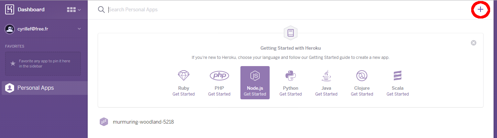
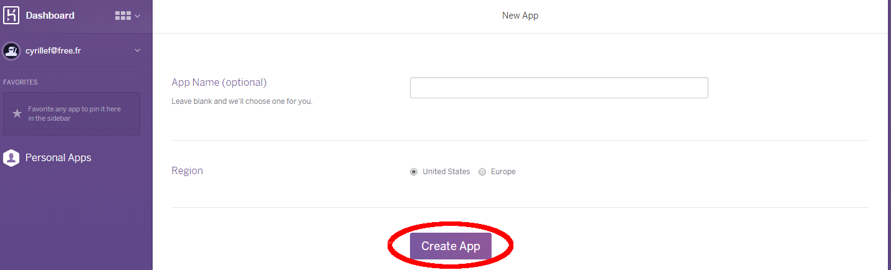
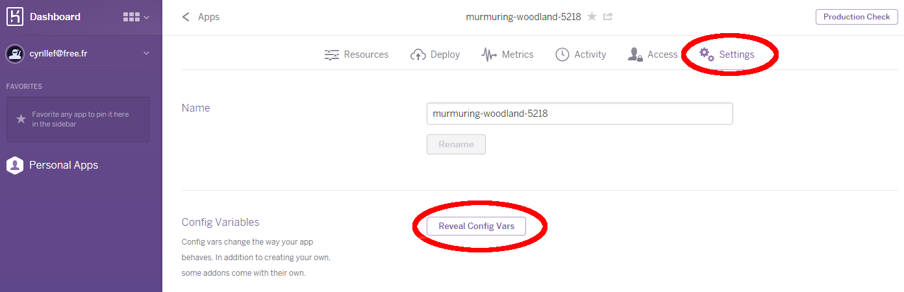
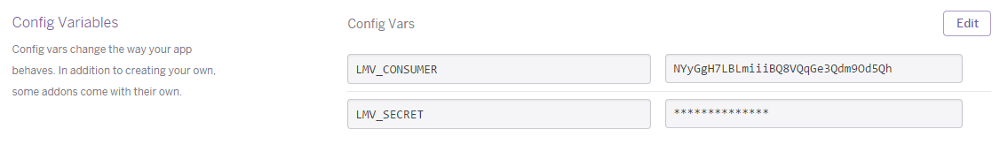
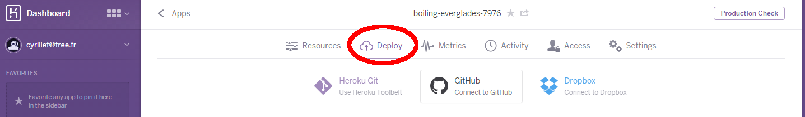
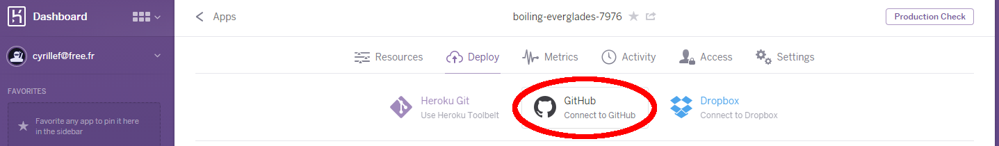
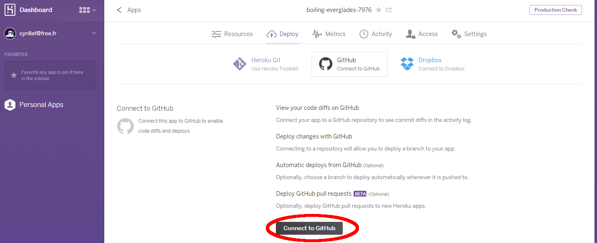
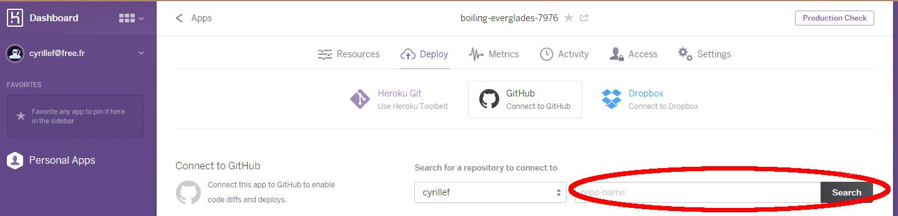
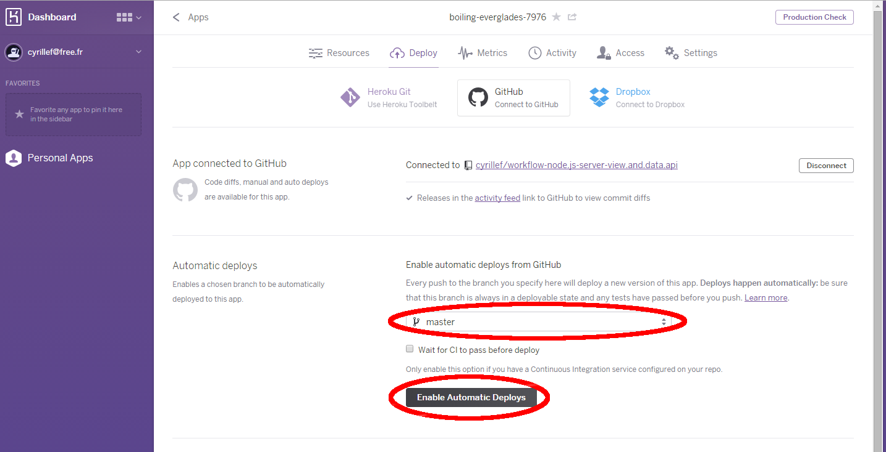
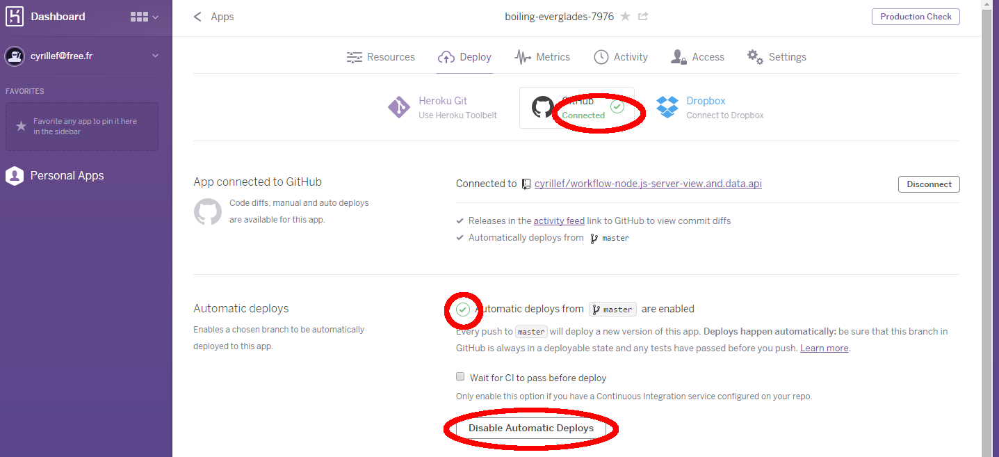

# Appendix D: Automatic deployment on the web with Heroku

In this workshop, you developed your web service on the local machine (i.e. http://localhost/) which means that only yourself and people 
on the same network can eventually access your web site using your ip address.

For example, you can use http://localhost/ or http://127.0.0.1/ to access your machine web site (127.0.0.1 is the default address for your network card),
and other people should use the real ip address instead (usually something like http://192.168.1.55/). Running a web site on the local machine is only 
required for development purpose, but you may want to make the web site available to anyone in the world. To do this you need to deploy your web site 
on a web server.

A very easy way to do this is to use ['heroku'](https://www.heroku.com/) which has a nice feature to deploy a web site from github. And Heroku provides up to 5 free apps.
<b>However, since you do not want to put your consumer and secret keys on your public github repository, you cannot use this technique. You either need to have
a private repo (ignore Step 4-6), or store your keys as system variables on the running instance, and change your code to grab the keys from the system (Step 4-6).</b>

<b>Step 1</b> Sign up on [heroku.com](https://www.heroku.com/) for a free account

<b>Step 2</b> Create a node.js server by selecting the '+' sign on the top-right corner

 
 
<b>Step 3</b> Push the 'Create App' button. You can leave the name field empty, and use the location you prefer.

 
 
<b>Step 4</b> By default, heroku will show the 'Deploy' page, select 'Settings', and in this page, press the button 'Reveal Config Vars'.

 
 
<b>Step 5</b> Create 2 variables, where you store the keys which you obtained in Chapter 1. 

 

<b>Step 6</b> Switch to the 'Deploy' page by selecting 'Deploy'

 
 
<b>Step 7</b> Next, select 'GitHub - Connect to GitHub'

 

<b>Step 8</b> Next, Press 'Connect to GitHub'

 

<b>Step 9</b> Search for your repo

 

<b>Step 10</b> When your repo was found, press the connect button

 

<b>Step 11</b> Finally, choose the branch you want to auto-deploy (usually master), and press the 'Enable Automatic Deploys' button.

 

 Now, heroku should show the following when you'll come back on your server dashboard.
 
 
 
 Whenever you will push a change on github, the site will be rebuilt with the source found on your GitHub repository.
 
<b>Note:</b> You can still deploy manually if you want, by pressing the 'Deploy Branch' button at the bottom of the page. 
This is actually needed for the first time unless you push a change on github.

<b>Note</b> On the 'Activity' tab, you can see when and if your site was rebuilt successfully or not.


<b>Important: </b> to let heroku know how to build the web site automatically, you need to provide a proper '<b>package.json</b>' file where you mention the dependencies 
and the main server script. An example is provided below:
```
{
	"name": "AdnViewerBasic",
	"description": "A basic node.js server sample",
	"version": "1.0.0",
	"dependencies": {
		"serve-favicon": ">= 0.0.2",
		"express": ">= 4.12.3",
		"request": ">= 2.55.0"
	},
	"files": [
		"LICENSE",
		"README.md"
	],
	"engines": {
		"node": ">= 0.10.0"
	},
	"contributors": [
		"MyName <myname@mydomain.org>"
	],
	"license": "MIT",
	"scripts": {
		"start": "node server.js"
	},
	"repository": {
		"type": "git",
		"url": "https://github.com/Developer-Autodesk/workflow-node.js-view.and.data.api.git"
	}
}
```


=========================  
[Home](README.md)
