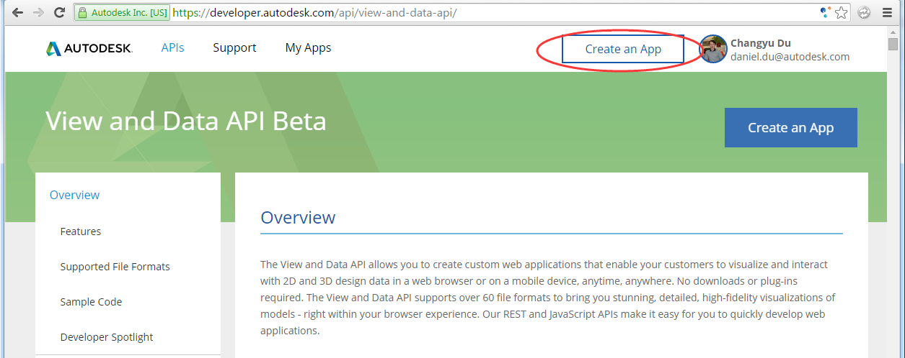
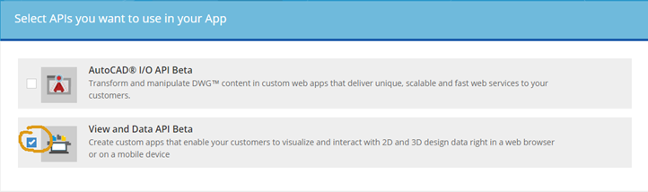
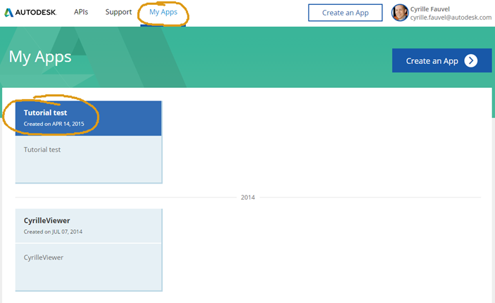
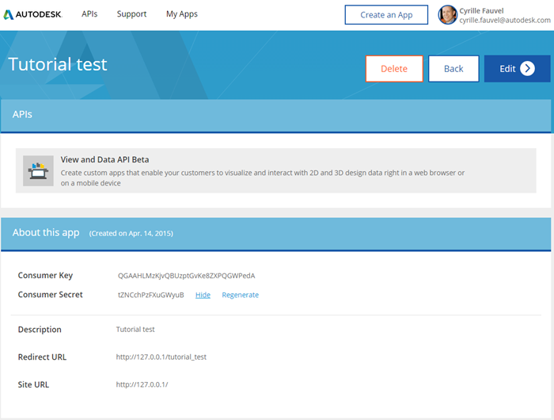

<a name="Chapter1"></a>
# Chapter 1 - Get ready with the View & Data API

- [Obtaining an API Key](#ObtainingAnAPIKey)
- [Prepare a model](#PrepareAModel)
- [Create your web server](#CreateYourWebServer)


<a name="ObtainingAnAPIKey"></a>
## Obtaining an API Key

All View & Data API applications access the service using an API key.
The API key enables you to monitor your application's API usage and ensures that Autodesk can contact you
about your application if necessary. Because these keys are used to authenticate your access to the API, this also protects your data from being accessed without your permission.

To create your API key:

* Visit the [Autodesk Developers Page](https://developer.autodesk.com/api/view-and-data-api/) and sign in with your Autodesk Account, or click the Sign Up link to create an account for free
if you don't already have one.

* Click the 'Create an App' link.

 

* Select the API you want to generate a key for. For this tutorial, select the 'View and Data API'.

 

* Complete the form and submit your request by pushing the 'Create App' button. Your application will appear in your application list. (Note: The 'Redirect URL' field is a required field,
but you don't have to provide a real URL if you don't have one - just add something like 'http://www.mysite.com').

 

* Click on the newly created App to access your Consumer Key and Secret. You can review your App and API keys whenever you like by clicking on the 'My Apps' link after signing in.

 

By default, a key can be used on any site and application. However, we strongly recommend that you restrict the use of your key to domains that you administer, to prevent
use on unauthorized sites. We also recommend you create a new App (API key) for every new application rather than reusing the same key in multiple applications.


<a name="PrepareAModel"></a>
## Prepare a model

Now you have your API key, the next step is to upload and translate a model so it can be displayed on your webpage.


### Upload a model on the Autodesk View & Data server

Upload one of your models to your account and get its URN using the following [web page](http://models.autodesk.io).

Alternatively, you can use one of the following desktop solutions instead if you prefer:

- with a [Windows .NET WPF application](https://github.com/Developer-Autodesk/workflow-wpf-view.and.data.api)

- with a [Swift Mac OS application](https://github.com/Developer-Autodesk/workflow-macos-swift-view.and.data.api)

If you prefer using cURL or some other programming language, there are more samples in our
[GitHub collection](https://github.com/Developer-Autodesk?utf8=%E2%9C%93&query=workflow),
and on our [developer page](http://developer-autodesk.github.io).

If you don't have your own model to work with, some 2D and 3D sample models are provided with this workshop, in the [Sample files](https://github.com/Developer-Autodesk/tutorial-getting.started-view.and.data/tree/dev-2.0/Sample%20files) folder.

Each of this solutions will upload and translate a model on your account which you can use and view later.


### Steps to translate a model using the [web page](http://models.autodesk.io).

1. Enter you Consumer key and secret key, and press the 'Get my access token' button

2. Select one of the models from the 'Samples' list. For example the 'Robot Arm' sample. Or Drag 'n Drop one of yours on the gray area. Then press the 'Translation this one for me' button.

3. You should see a progress bar in the 'Currently translating...' area, please give it some time, ...

4. Once the translation is over, You would see your model listed int he 'Ready"' section with the 'urn' that you need later. Make sure to copy and save that urn somewhere for later use.


<a name="CreateYourWebServer"></a>
## Create your web server

For this tutorial, we'll create a minimal Node.js web server to serve your html/css/js files as usual as well as providing code to access your translated files.
If you prefer to use another web server technology, you can adapt these instructions yourself to serve the index.html file included with the project.


### Download the sample' node.js dependencies

Before you can run the sample, you need to download the node.js dependency modules used by the sample. You do this by executing the following command:
```
npm install
```
This command will download the following modules, into the node_modules directory:

* express: Express is a minimal and flexible Node.js web application framework that provides a robust set of features for web and mobile applications.
* request: Request is designed to be the simplest way possible to make http calls. It supports HTTPS and follows redirects by default.
* serve-favicon: Node.js middleware for serving a favicon.

### Setup your local server

Rename or copy the ./credentials_.js file into ./credentials.js

Windows
```
copy credentials_.js credentials.js
```
OSX/Linux
```
cp credentials_.js credentials.js
```
Configure your local server with your keys. Replace the placeholder with your own keys in credentials.js, line #29 and #30
```
credentials.ClientId = '<replace with your consumer key>';

credentials.ClientSecret = '<replace with your consumer secret>';
```
Copy the URN which you generated prior installing the server in file /www/index.js at line #18
```
var defaultUrn = '<replace with your encoded urn>';
```
Run the server from the Node.js console, by running the following command:
```
node server.js
```


### View your model in a web browser

Connect to your local server using a WebGL-compatible browser:

[http://localhost:3000/](http://localhost:3000/)

Note that we use port 3000 and not the default http port 80 because if you are on Mac OSX or use Skype, port 80 may be already in use. If you want to use port 80 to avoid
having to specify the port in the URL, edit the server.js file and change the default port from 3000 to 80, and restart the node.js server.


=========================
[Next](chapter-2.md#Chapter2) -
[Home](README.md)