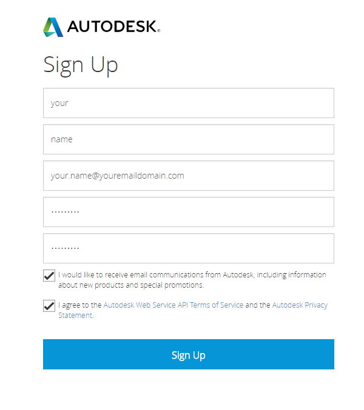
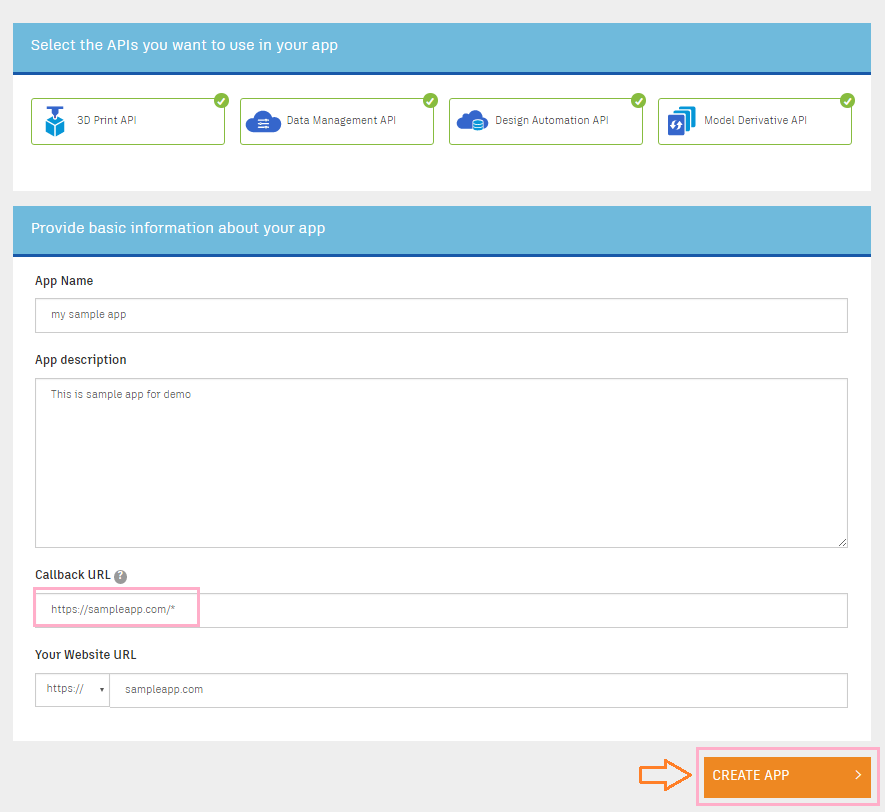

<a name="Chapter1"></a>
# Chapter 1 – Get ready with Model Derivative API

- [Create an App](#CreateAnApp)
- [Prepare a model](#PrepareAModel)
- [Create your web server](#CreateYourWebServer)


<a name="CreateAnApp"></a>
## Create an App

Before getting started with the Forge Platform, you need to set up an app and get your client ID and secret.

* Step 1: Log in to the Dev Portal
Go to the [Dev Portal](https://developer.autodesk.com/).



*If You Already Have an Autodesk Account

Click the “SIGN IN” button.
In the next “Sign In” screen, enter your email address and password, and click “Sign In” to log in to the Dev Portal.


* Step 2: Create an App
Once you’re signed in, you can create your application.


Click the “CREATE APP” button on the top-right in the “My Apps” page, in the next screen,



Select APIs you are going to use.
Enter your application name and description.
Enter a callback URL. Note that wildcards are allowed in the path (but not in the hostname). For more information, see the “callback URL” definition in [API Basics](https://developer.autodesk.com/en/docs/oauth/v2/overview/basics).

*Step 3: Note Your Client ID and Secret
Once you set up an application, you will see a Client ID and Client Secret in your newly created app page. You will need these in all other OAuth flows and, by extension, to complete every other tutorial on this site!


By default, a key can be used on any site and application. However, we strongly recommend that you restrict the use of your key to domains that you administer, to prevent
use on unauthorized sites. We also recommend you create a new App (API key) for every new application rather than reusing the same key in multiple applications.

If you want to learn more about oAuth 2 legged and 3 legged token, check out the rest of the [Step-by-Step guide](https://developer.autodesk.com/en/docs/oauth/v2/tutorials/).


<a name="PrepareAModel"></a>
## Prepare a model

Now you have your API key, the next step is to upload and translate a model so it can be displayed on your webpage.


### Upload a model on the Autodesk server

Upload one of your models to your account and get its URN using the following [web page](http://models.autodesk.io).

Alternatively, you can use one of the following desktop solutions instead if you prefer:

- [Windows .NET WPF application](https://github.com/Developer-Autodesk/workflow-wpf-view.and.data.api)
- [Swift Mac OS application](https://github.com/Developer-Autodesk/workflow-macos-swift-view.and.data.api)
- [Mac OS cURL command line scripts](https://github.com/Developer-Autodesk/workflow-curl-view.and.data.api)

If you prefer using other programming languages or methods, there are even more samples in our
[GitHub collection](https://github.com/Developer-Autodesk?utf8=%E2%9C%93&query=workflow)
and on the [developer page](http://developer-autodesk.github.io).

If you don't have your own model to work with, some 2D and 3D sample models are provided with this workshop, in the
[Sample files](
https://github.com/Developer-Autodesk/tutorial-getting.started-view.and.data/tree/master/Sample%20files) folder.

Each of these solutions will upload and translate models on your account which you can use and view later.


### Steps to translate a model using the [web page](http://models.autodesk.io).

1. Enter you Consumer key and secret key, and press the 'Get my access token' button

2. Select one of the models from the 'Samples' list. For example the 'Robot Arm' sample. Or Drag 'n Drop one of yours on the gray area. Then press the 'Translation this one for me' button.

3. You should see a progress bar in the 'Currently translating...' area, please give it some time, ...

4. Once the translation is over, You would see your model listed int he 'Ready"' section with the 'urn' that you need later. Make sure to copy and save that urn somewhere for later use.


<a name="CreateYourWebServer"></a>
## Create your web server

For this tutorial, we'll create a minimal Node.js web server to serve your html/css/js files as usual as well as providing code to access your translated files.

If you prefer to use another web server technology, you can adapt these instructions yourself to serve the index.html file included with the project.


### Download the node.js basic server sample

Check out the appropriate workshop starting point version of the node.js skeleton application from the
[View and Data API Node.js basic sample](https://github.com/Developer-Autodesk/workflow-node.js-view.and.data.api)
as explained in [Prerequisites - Get the sources](../prerequisites.md#GetTheSources):

```
$ git clone https://github.com/Developer-Autodesk/workflow-node.js-view.and.data.api
$ cd workflow-node.js-view.and.data.api
$ git checkout v1.0-workshop
```


### Download the sample node.js dependencies

Before you can run the sample, you need to download the node.js dependency modules used by the sample. You do this by executing the following command:
```
npm install
```
This command will download the following modules into the node_modules directory:

* express: Express is a minimal and flexible Node.js web application framework that provides a robust set of features for web and mobile applications.
* request: Request is designed to be the simplest way possible to make http calls. It supports HTTPS and follows redirects by default.
* serve-favicon: Node.js middleware for serving a favicon.

### Setup your local server

Rename or copy the ./credentials_.js file into ./credentials.js

Windows
```
copy credentials_.js credentials.js
```
OSX/Linux
```
cp credentials_.js credentials.js
```
Configure your local server with your keys. Replace the placeholder with your own keys in credentials.js, line #29 and #30
```
client_id: process.env.CONSUMERKEY || '<replace with your consumer key>',

client_secret: process.env.CONSUMERSECRET || '<replace with your consumer secret>',
```
Copy the URN which you generated prior installing the server in file /www/index.js at line #18  
Note: the URN needs to be base64 encoded as mentioned [here](https://developer.autodesk.com/api/view-and-data-api/) under "Step 6: Register Your Data with the Viewing Services"
```
var defaultUrn = '<replace with your encoded urn>';
```
Run the server from the Node.js console, by running the following command:
```
node server.js
```


### View your model in a web browser

Connect to your local server using a WebGL-compatible browser:

[http://localhost:3000/](http://localhost:3000/)

Note that we use port 3000 and not the default http port 80 because if you are on Mac OSX or use Skype, port 80 may already be in use.
If you want to use port 80 to avoid having to specify the port in the URL, edit the server.js file, change the default port from 3000 to 80 and restart the node.js server.


=========================
[Next](chapter-2.md#Chapter2) -
[Home](../README.md)
