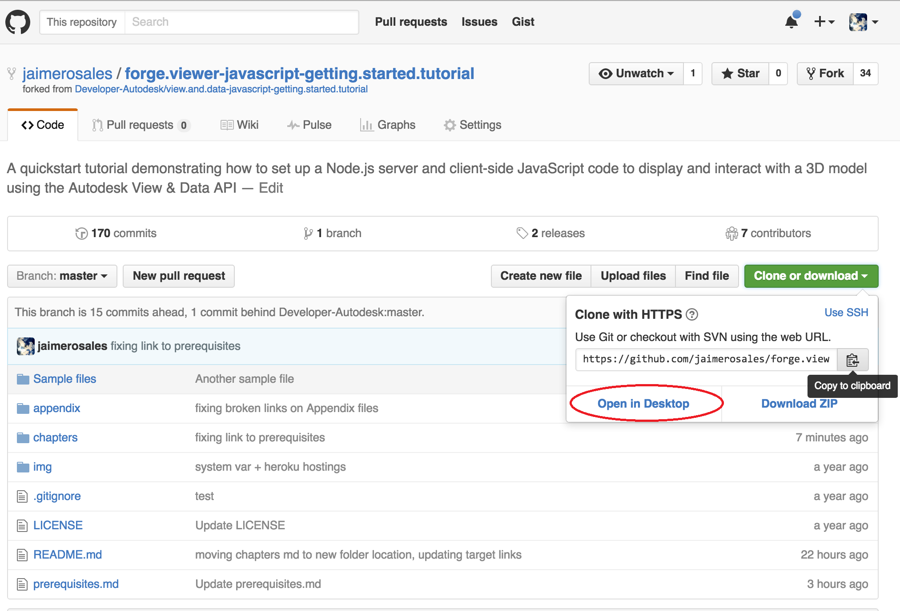
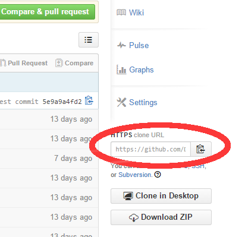
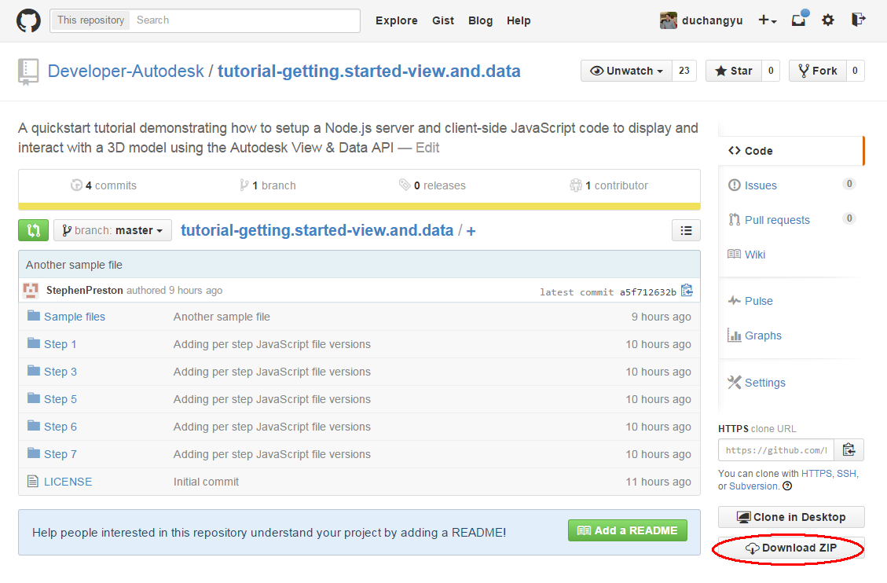
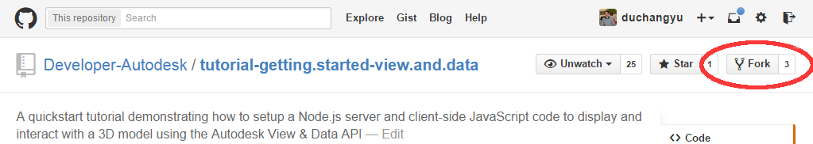

<a name="Prerequisites"></a>
# Prerequisites

  - [Familiar with git?](#FamiliarWithGit)
  - [Install Node.js](#InstallNodeJs)
  - [Install a code editor](#InstallCodeEditor)
  - [Get the sources](#GetTheSources)


<a name="FamiliarWithGit"></a>
## Familiar with git?

[Git](http://www.git-scm.com) is a free and open source distributed version control system.
It enables teams to work together efficiently, all using the same files.

It also helps teams cope with the confusion that can happen when multiple people are editing the same files.

This tutorial is hosted on GitHub, a Git repository hosting service, that also adds many of its own additional features.

While Git is a command line tool, GitHub provides a Web-based graphical interface and a GUI tools.

It also provides access control and several collaboration features, such as a Wiki and basic task management tools for every project.

If you do not have git installed already, you can get it from here:

- [Windows](https://windows.github.com)
- [Mac OSX](https://mac.github.com)
- [Linux](http://git-scm.com/download/linux)

Here are some [additional setup instructions](https://help.github.com/articles/set-up-git), and many other questions are covered by the [GitHub Help](https://help.github.com).

Here is a [github quick learning tutorial](https://try.github.io/levels/1/challenges/1) if you never used git before. Note it is a command line tutorial; you may prefer the GUI or WEB interfaces instead.

Once you have a GitHub client installed, you can clone a repository from GitHub.

Go to the the repository you want to download locally and clone the source code by clicking the 'Clone in Desktop' button.

 

Here is the equivalent command line:
```
git clone <your repository git url>
```

Your repository git url can be obtain from the 'HTTPs clone URL' box or by copying it from the GitHub repository web page.

 

This creates the a copy of the entire repository source on your local drive.
This 'clone' directory contains copies of the repository files for you to work with.
However, it is important to note here that you cannot save your changes back to the source repo unless you got write permission.
To be able to save back to the repo you cloned, you either need to be a contributor to that repo, or have cloned one of your own repos.
If you want to work from somebody else's repo and be able to edit and save your changes, please consider 'forking' the repo in your own account, then cloning that repo instead.
See the instructions below on [how to fork a repo](#Fork).

If you prefer not to install git, you can download a zip file instead by clicking the 'Download ZIP' button.

 

In this workshop, we will provide the command line instructions, but please feel free to use whichever method you prefer.


### Main 'git' operations

```
git status
```
Displays the list of changes in your working tree vs the repo on GitHub.

```
git add <file> [<file>] ...
```
This command updates the index using the current content found in the working tree, to prepare the content staged for the next commit.
A shortcut to add all changes for the next commit is to use `git add -A`.

```
git commit -m "my message"
```
Stores the current contents of the index in a new commit along with a log message from the user describing the changes.

```
git push
```
Updates the remote repo with your commit.

```
git pull
```
Retrieves changes from the remote repo into your working tree.

```
git checkout <name>
```
Either checkout a tag version or a branch. Updates files in the working tree to match the version in the index or the specified tree.


### git command line

Using git from the command line on Mac OSX or Linux is straight forward; just open a terminal window (on Mac OSx - Applications -> Utilities -> Terminal.app).
git, node, and npm commands should work from there if present on your system.

On Windows, you can choose between few options: a bash console, a powershell console, or the standard command prompt.
You can decide which one to use from the GitHub tool in the settings panel.
You would access the git console by running the 'Git Shell' icon which should be on your Desktop or in your Programs list.
Node and npm commands have their own command prompt window which is different from GitHub.


<a name="Fork"></a>
### Fork option

Last, someone may want to work with the workshop material and save modifications to it to their own github account.
In this case, you need to 'fork' the repository from your account and clone the 'forked' repository.
To fork a repository, log in to GitHub using your account, go to the repository you want to fork, and press the 'Fork' button.

 


<a name="InstallNodeJs"></a>
## Install Node.js

If you want to run the preconfigured local web-server and the test tools then you will also need [Node.js v0.12.2+](https://nodejs.org/download/).

You can download a Node.js installer for your operating system from [nodejs.org](http://nodejs.org/download/).
Check the version of Node.js that you have installed by running the following command:

	node --version

In Debian based distributions, there is a name clash with another utility called node.
The suggested solution is to also install the nodejs-legacy apt package, which renames node to nodejs:

	apt-get install nodejs-legacy npm

	nodejs --version

	npm –version

If you need to run different versions of node.js in your local environment, consider installing [Node Version Manager (nvm)](https://github.com/creationix/nvm).


<a name="InstallCodeEditor"></a>
## Install a code editor

If you have programmed before, you may already have a favorite programmer's editor.
However, if you do not, or were thinking about trying other editors anyway,
spend some time trying and considering these options common in the javascript/node.js community ...

Note that they are listed in alphabetical order, not in any order of preference.

    | Windows | Mac OSX | Linux | Free/Paid | Git integration | Includes a node.js server
--- | ------------- | -------------- | -------- | -------------- | -------------------- | ----------------------------------
[Brackets](http://brackets.io/) | yes | yes | yes | Free | yes | yes
[Eclipse](http://eclipse.org/) | yes | yes | yes | Free | yes | yes
[Emacs](http://www.gnu.org/software/emacs/) | yes | yes | yes | Free | yes | -
[Notepad++](http://notepad-plus-plus.org/) | yes | - | - | Free | - | -
[textmate](http://macromates.com/) | - | yes | - | Paid | via scripting | -
[Sublime Text](http://www.sublimetext.com/) | yes | yes | yes | Paid | via a plugin | -
[WebMatrix](http://www.microsoft.com/web/webmatrix/) | yes | - | - | Free | yes | yes
[WebStorm](https://www.jetbrains.com/webstorm/) | yes| yes | yes | Paid | yes | yes


<a name="GetTheSources"></a>
## Get the sources

We assume you want to start a project and work as a team.
For this reason, you want to use 'git' and be able to share the sources across the members of your team,
and later deploy it on a web server.
Your first action will be to fork the material repository on your 'github' account.
If you prefer not to use git, you can still download the zip files and inflate their contents on your local drive.

* Using git
  - Sign in using your GitHub account at [http://www.github.com](http://www.github.com)
  - Go to the [Node.js simple server project](https://github.com/Developer-Autodesk/workflow-node.js-view.and.data.api)
  - Fork the project
  - Copy your fork URL, e.g. `https://github.com/username/workflow-node.js-view.and.data.api`
  - Clone your fork locally to a new directory, e.g. `nodevadasample`:
  ```
  git clone https://github.com/username/workflow-node.js-view.and.data.api nodevadasample
  ```
  - Enter the new directory:
  ```
  cd nodevadasample
  ```
  - Check out the workshop starting point to ensure you have the correct version of the material for the following instructions:
  ```
  git checkout v1.0-workshop
  ```

* Not using git
  - Go to the [Node.js simple server project](https://github.com/Developer-Autodesk/workflow-node.js-view.and.data.api)
  - Download the ZIP file from [here](https://github.com/Developer-Autodesk/workflow-node.js-view.and.data.api/releases/tag/v1.0-workshop)
  - Inflate the ZIP file on your hard drive
  - Make the inflated directory your current directory

The tutorial instructions, from now on, assume you are running all commands from the *workflow-node.js-view.and.data.api* directory.


=========================
[Next](chapter-1.md#Chapter1) -
[Home](README.md)