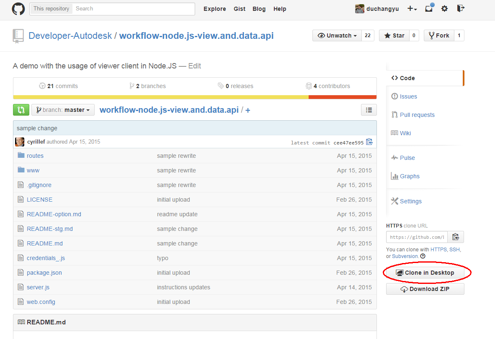
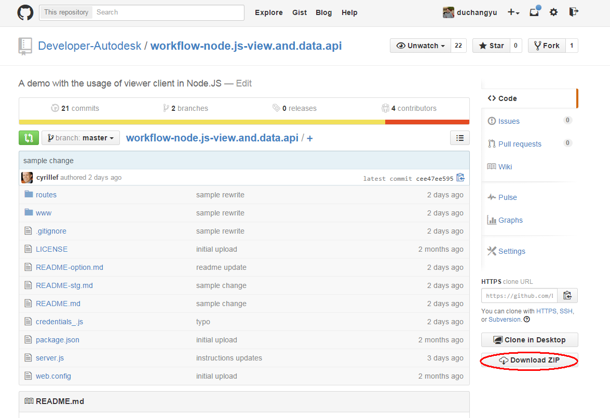

# Autodesk View & Data API - Getting Started Tutorial


## Audience

This documentation is designed for people familiar with [JavaScript](http://www.ecma-international.org/publications/standards/Ecma-262.htm) programming and object-oriented programming concepts. You should also be familiar with the Autodesk View & Data technology from a user's point of view. You can play with the technology [here](https://360.autodesk.com/viewer) - simply Drag 'n Drop a 2D/3D file, and enjoy the result in your browser with no extension or plug-in installed on your computer or device.

This conceptual documentation is designed to let you quickly start exploring and developing applications with the Autodesk View & Data API.

## What do you need for your project?

The View & Data web service consists of two APIs. The First API is a REST API which allows you to upload and translate 2D/3D models into a light weight ftormat that can be downloaded and displayed by the Second API – a client-side JavaScript API that allows you to embed and customize/automate an interactive 2D/3D model viewer on your web page.

Depending of your needs you may prefer to write a server or a desktop application to consume the REST API. Your choice will be mainly based on how many files you need to translate, and the frequency:

1- If you need to translate only one (or very few) of your own models to be viewed by other people, then you may prefer to use a desktop application to do this, or one of our demo pages.

2- If you need to translate multiple models in a batch process or allow other users to upload their own files, then a webserver implementation will be needed.

## Obtaining an API Key

All View & Data API applications must access the service using an API key. Using an API key enables you to monitor your application's API usage, and ensures that Autodesk can contact you about your application if necessary. Because these keys are used to authenticate your access to the API, this also protects your data from being accessed without your permission.

To create your API key:

* Visit the [Autodesk Developers Page](https://developer.autodesk.com/api/view-and-data-api/) and Sign In with your Autodesk Account (or click the Sign Up link can create an account for free if you don't already have one).

* Click the 'Create an App' link.

 
 
* Select the 'API' you want to generate a key for. For this tutorial, select the 'View and Data API'.

 
 
* Complete the form, and submit your request by pushing the 'Create App' button. Your application should now appear in your application lists. (Note: The 'Redirect URL' field is a required field, but you don't have to provide a real URL if you don't have one - just add something like 'http://www.mysite.com').
 
 
 
* Click on the App you just created to access your Consumer Key and Secret. You can review your App and API keys whenever you like my clicking on the 'My Apps' link after signing in.

 
 
By default, a key can be used on any site / application. However, we strongly recommend that you restrict the use of your key to domains that you administer, to prevent use on unauthorized sites. We also recommend you create a new App (API key) for every new application (rather than reusing the same key in multiple applications).


## Prepare a model

Now you have your API key, the next step is to upload and translate a model so it can be displayed on your webpage.

### Upload a model on the Autodesk View & Data server

Upload one of your models to your account and get its URN using the following [web page](http://models.autodesk.io).  

Alternately, you can also use one of the desktop solutions below if you prefer:

  - with a [Windows .Net WPF application](https://github.com/Developer-Autodesk/workflow-wpf-view.and.data.api)

  - or with a [Swift Mac OS application](https://github.com/Developer-Autodesk/workflow-macos-swift-view.and.data.api)

If you prefer using cURL or another programming languages, there are more samples on our [github account](https://github.com/Developer-Autodesk?utf8=%E2%9C%93&query=workflow), or our [developer page](http://developer-autodesk.github.io/).

There are some 3D model samples available in this [GitHub tutorial repository](https://github.com/Developer-Autodesk/tutorial-getting.started-view.and.data) (in the 'Sample files' folder) if you don't have your own. You can clone or download the repository to access them.

If you have github client ([GitHub for Windows](https://windows.github.com/) or [GitHub for Mac](https://mac.github.com/)) installed, you can clone the tutorial [repository](https://github.com/Developer-Autodesk/tutorial-getting.started-view.and.data) from github.com. Go to [https://github.com/Developer-Autodesk/tutorial-getting.started-view.and.data](https://github.com/Developer-Autodesk/tutorial-getting.started-view.and.data)  and clone the source code by click the "Clone in Desktop" button.

 
 
If you prefer command line, using following command.
	
	git clone https://github.com/Developer-Autodesk/tutorial-getting.started-view.and.data.git
	
This command creates the *tutorial-getting.started-view.and.data* directory in your current directory. In this directory, you can find the sample files and finished files in following steps.

If you do not have github client or Git installed, you can download the code by clicking "Download ZIP" and extract to a folder, which contains the sample files and finished files in following steps.

 

### View your model

**TODO:**
**To be done**


## Create your web server

For this tutorial, we'll create a minimal Node.js web server to serve your html/css/js files as usual as well as providing code to access your translated files. If you prefer to use another web server technology, then you'll have to adapt these instructions yourself to serve the index.html file included with the project.

### Install Node.js

If you want to run the preconfigured local web-server and the test tools then you will also need [Node.js v0.12.2+](https://nodejs.org/download/).

You can download a Node.js installer for your operating system from [http://nodejs.org/download/](http://nodejs.org/download/). Check the version of Node.js that you have installed by running the following command:

	node --version

In Debian based distributions, there is a name clash with another utility called node. The suggested solution is to also install the nodejs-legacy apt package, which renames node to nodejs:

	apt-get install nodejs-legacy npm

	nodejs --version

	npm –version

If you need to run different versions of node.js in your local environment, consider installing [Node Version Manager (nvm)](https://github.com/creationix/nvm).

### Download and setup your local server

Clone the View & Data Node.js basic server to start your web application.

Note that, if you do not have git installed already, you can get it from here: [Windows](https://windows.github.com/), [Mac OSX](https://mac.github.com/), and [Linux](http://git-scm.com/download/linux). And get additional setup instructions [here](https://help.github.com/articles/set-up-git). If you wish to not install git, you can download a zip file of the sources instead from [here](https://github.com/Developer-Autodesk/workflow-node.js-view.and.data.api/releases/tag/v1.0-workshop).

If you have github client installed, you can clone the source code from github.com. Go to [https://github.com/Developer-Autodesk/workflow-node.js-view.and.data.api](https://github.com/Developer-Autodesk/workflow-node.js-view.and.data.api) and clone the source code by click the "Clone in Desktop" button.

 

If you prefer command line, using following command.
```
git clone https://github.com/Developer-Autodesk/workflow-node.js-view.and.data.api.git
```
This command creates the workflow-node.js-view.and.data.api in your current directory.

If you do not have github client or Git installed, you can download the code by clicking "Download ZIP" and extract to a folder.

 

Change your current directory to workflow-node.js-view.and.data.api
```
cd workflow-node.js-view.and.data.api
```

The tutorial instructions, from now on, assume you are running all commands from the *workflow-node.js-view.and.data.api* directory.

Last, if you did use git and to make sure we work on the material made for this workshop, execute the following command:
```
git checkout v1.0-workshop
```

Once you have Node.js installed on your machine, and you cloned the repository, you can download the tool dependencies by running:
```
npm install
```
This command will download the following tools, into the node_modules directory:

* express: Express is a minimal and flexible Node.js web application framework that provides a robust set of features for web and mobile applications.
* request: Request is designed to be the simplest way possible to make http calls. It supports HTTPS and follows redirects by default.
* serve-favicon: Node.js middleware for serving a favicon.

Rename or copy the ./credentials_.js file into ./credentials.js

Windows
```
copy credentials_.js credentials.js
```
OSX/Linux
```
cp credentials_.js credentials.js
```
Configure your local server with your keys. Replace the placeholder with your own keys in credentials.js, line #29 and #30
```
credentials.ClientId = '<replace with your consumer key>';

credentials.ClientSecret = '<replace with your consumer secret>';
```
Copy the URN which you generated prior installing the server in file /www/index.js at line #18
```
var defaultUrn = '<replace with your encoded urn>';
```
Run the server from the Node.js console, by running the following command: 
```
node server.js
```


### View your model in a web browser

Connect to your local server using a WebGL-compatible browser:

[http://localhost:3000/](http://localhost:3000/)

Note that we use port 3000 and not the default http port 80 because if you are on Mac OSX or use Skype, port 80 may be already in use. If you want to use port 80 to avoid having to specify the port in the URL, edit the server.js file and change the default port from 3000 to 80, and restart the node.js server.


### Extend your web server to support the upload/translation workflow

If you do not need the model translation workflow on your server or webpage, you can skip these steps and continue with the next chapter ‘Customizing the Viewer Behavior’.

Before you decide if you want to handle translation in your web application, you first need to decide if you want to do the translation from the server or the client. The only important step was to make sure the access token was generated on the server side to avoid anyone to steal your consumer key and secret. That step was done in the previous steps. Now, once you have a valid access token, you can do the translation either on the client (javascript code running in the browser) or on the server (javascript code running on the node.js server). The path you choose depends on what you want to achieve. Running on the client side means no files are transitioning via your server, and you aren’t using any server cpu time. Running from the server means that you control everything your users are doing.

Either choose ‘Translating from the client’ or ‘Translating from the server’ as the next step.

#### Translating from the client

<b>Step 1:</b> Create a new html page and javascript file – i.e. upload.html and upload.js. Then copy the following basic html skeleton code into the file and save it.

upload.html
```
<html>
<head>
    <title>ADN Viewer Demo (client upload)</title>
    <link rel="shortcut icon" href="/images/favicon.ico" type="image/x-icon" />

    <!-- jquery -->
    <script src="https://code.jquery.com/jquery-2.1.2.min.js"></script>

    <!-- Bootstrap CSS -->
    <link href="http://netdna.bootstrapcdn.com/bootstrap/3.3.4/css/bootstrap.min.css" rel="stylesheet" />
   
    <!-- Autodesk.ADN.Toolkit.Viewer -->
    <script src=" https://rawgit.com/Developer-Autodesk/library-javascript-view.and.data.api/master/js/Autodesk.ADN.Toolkit.ViewData.js"></script>
    <script src="/upload.js"></script>
</head>

<body>

</body>
</html>
```

upload.js
```
var oViewDataClient =null ;

$(document).ready (function () {
	oViewDataClient =new Autodesk.ADN.Toolkit.ViewData.AdnViewDataClient (
		'https://developer.api.autodesk.com',
		'http://' + window.location.host + '/api/token'
	) ;
}) ;
```

<b>Step 2:</b> Add controls in your html page to post files for translation. Add the following code between the <body></body> tags. There is a lot of tag required to have a nice layout, but the functional controls are marked in red.
```
<div class="container">
        <div class="panel panel-default">
            <div class="panel-heading">
                <h3 class="panel-title">Upload and translate a file</h3>
            </div>
            <div class="panel-body">
                <input class="form-control" type="file" id="files" name="files" multiple />
                <br />
                <div style="text-align: center;">
                    <a class="btn btn-primary" id="btnTranslateThisOne">Translate this one for me</a>
                </div>

                <br />
                <div id="msg"></div>
            </div>
        </div>
    </div>

    <div class="container">
        <div class="panel panel-default">
            <div class="panel-heading">
                <h3 class="panel-title">My URNs</h3>
            </div>
            <div class="panel-body">
                <div class="row">
                    <div class="col-md-8">
                        <input class="form-control" type="text" id="urn" name="urn" value="" />
                    </div>
                    <div class="col-md-4">
                        <a class="btn btn-primary" id="btnAddThisOne">Add to the list</a>
                    </div>
                </div>

                <br />
                <legend>My URN list</legend>
                <div>Click on a urn below to launch the viewer</div>
                <div id="list"></div>
            </div>
        </div>
    </div>
```

<b>Step 3:</b> Add the following code in your javascript to handle translation.
```
$(document).ready (function () {
	oViewDataClient =new Autodesk.ADN.Toolkit.ViewData.AdnViewDataClient (
		'https://developer.api.autodesk.com',
		'http://' + window.location.host + '/api/token'
	) ;

	$('#btnTranslateThisOne').click (function (evt) {
		var files =document.getElementById('files').files ;
		if ( files.length == 0 )
			return ;
		var bucket =
			'model'
			+ new Date ().toISOString ().replace (/T/, '-').replace (/:+/g, '-').replace (/\..+/, '')
			+ '-' + '<my_consumer_key>'.toLowerCase ().replace (/\W+/g, '') ;

		createBucket (bucket, files)
	}) ;

	$('#btnAddThisOne').click (function (evt) {
		var urn =$('#urn').val ().trim () ;
		if ( urn == '' )
			return ;
		AddThisOne (urn) ;
	}) ;
}) ;

function AddThisOne (urn) {
	var id =urn.replace (/=+/g, '') ;
	$('#list').append ('<div class="list-group-item row">'
			+ '<button id="' + id + '" type="text" class="form-control">' + urn + '</button>'
		+ '</div>'
	) ;
	$('#' + id).click (function (evt) {
		window.open ('/?urn=' + $(this).text (), '_blank') ;
	}) ;
}

function createBucket (bucket, files) {
	var bucketData ={
		bucketKey: bucket,
		servicesAllowed: {},
		policy: 'transient'
	} ;
	oViewDataClient.createBucketAsync (
		bucketData,
		//onSuccess
		function (response) {
			console.log ('Bucket creation successful:') ;
			console.log (response) ;
			$('#msg').text ('Bucket creation successful') ;
			uploadFiles (response.key, files) ;
		},
		//onError
		function (error) {
			console.log ('Bucket creation failed:');
			console.log (error) ;
			$('#msg').text ('Bucket creation failed!') ;
		}
	) ;
}

function uploadFiles (bucket, files) {
	for ( var i =0 ; i < files.length ; i++ ) {
		var file =files [i] ;
		//var filename =file.replace (/^.*[\\\/]/, '') ;
		console.log ('Uploading file: ' + file.name + ' ...') ;
		$('#msg').text ('Uploading file: ' + file.name + ' ...') ;
		oViewDataClient.uploadFileAsync (
			file,
			bucket,
			file.name,
			//onSuccess
			function (response) {
				console.log ('File was uploaded successfully:') ;
				console.log (response) ;
				$('#msg').text ('File was uploaded successfully') ;
				var fileId =response.objects [0].id ;
				var registerResponse =oViewDataClient.register (fileId) ;
				if (   registerResponse.Result === "Success"
					|| registerResponse.Result === "Created"
				) {
					console.log ("Registration result: " + registerResponse.Result) ;
					console.log ('Starting translation: ' + fileId) ;
					$('#msg').text ('Your model was uploaded successfully. Translation starting...') ;
					checkTranslationStatus (
						fileId,
						1000 * 60 * 5, // 5 mins timeout
						//onSuccess
						function (viewable) {
							console.log ("Translation was successful: " + response.file.name) ;
							console.log ("Viewable: ") ;
							console.log (viewable) ;
							$('#msg').text ('Translation was successful: ' + response.file.name + '.') ;
							//var fileId =oViewDataClient.fromBase64 (viewable.urn) ;
							AddThisOne (viewable.urn) ;
						}
					) ;
				}
			},
			//onError
			function (error) {
				console.log ('File upload failed:') ;
				console.log (error) ;
				$('#msg').text ('File upload failed!') ;
			}
		) ;
	}
}

function checkTranslationStatus (fileId, timeout, onSuccess) {
	var startTime =new Date ().getTime () ;
	var timer =setInterval (function () {
			var dt =(new Date ().getTime () - startTime) / timeout ;
			if ( dt >= 1.0 ) {
				clearInterval (timer) ;
			} else {
				oViewDataClient.getViewableAsync (
					fileId,
					function (response) {
						var msg ='Translation Progress ' + fileId + ': ' + response.progress ;
						console.log (msg) ;
						$('#msg').text (msg) ;
						if ( response.progress === 'complete' ) {
							clearInterval (timer) ;
							onSuccess (response) ;
						}
					},
					function (error) {
					}
				) ;
			}
		},
		2000
	) ;
}
```
And replace the string ‘&lt;my_consumer_key&gt;’ by your consumer key (not the consumer secret).

<b>Step 4:</b> Connect to your local server using a WebGL-compatible browser: 

[http://localhost:3000/upload.html](http://localhost:3000/upload.html)

You can get the final source code as zip from [here](https://github.com/Developer-Autodesk/workflow-node.js-view.and.data.api/archive/v1.0-workshop-client.zip), or using git:
```
git clone https://github.com/Developer-Autodesk/workflow-node.js-view.and.data.api.git
git checkout v1.0-workshop-client
```


#### Translating from the server

<b>Step 1:</b> Create a new html page and javascript file in folder /www – i.e. upload.html and upload.js. Then copy the following basic html skeleton code into the file and save it.

upload.html
```
<html>
<head>
    <title>ADN Viewer Demo (client upload)</title>
    <link rel="shortcut icon" href="/images/favicon.ico" type="image/x-icon" />

    <!-- jquery -->
    <script src="https://code.jquery.com/jquery-2.1.2.min.js"></script>

    <!-- Bootstrap CSS -->
    <link href="http://netdna.bootstrapcdn.com/bootstrap/3.3.4/css/bootstrap.min.css" rel="stylesheet" />
   
    <script src="/upload.js"></script>
</head>

<body>

</body>
</html>
```

upload.js
```
$(document).ready (function () {
}) ;
```

<b>Step 2:</b> Add controls in your html page to post files for translation. Add the following code between the <body></body> tags. There is a lot of tag required to have a nice layout, but the functional controls are marked in red.
```
<div class="container">
        <div class="panel panel-default">
            <div class="panel-heading">
                <h3 class="panel-title">Upload and translate a file</h3>
            </div>
            <div class="panel-body">
                <input class="form-control" type="file" id="files" name="files" multiple />
                <br />
                <div style="text-align: center;">
                    <a class="btn btn-primary" id="btnTranslateThisOne">Translate this one for me</a>
                </div>

                <br />
                <div id="msg"></div>
            </div>
        </div>
    </div>

    <div class="container">
        <div class="panel panel-default">
            <div class="panel-heading">
                <h3 class="panel-title">My URNs</h3>
            </div>
            <div class="panel-body">
                <div class="row">
                    <div class="col-md-8">
                        <input class="form-control" type="text" id="urn" name="urn" value="" />
                    </div>
                    <div class="col-md-4">
                        <a class="btn btn-primary" id="btnAddThisOne">Add to the list</a>
                    </div>
                </div>

                <br />
                <legend>My URN list</legend>
                <div>Click on a urn below to launch the viewer</div>
                <div id="list"></div>
            </div>
        </div>
    </div>
```

<b>Step 3:</b> Create a folder named ‘data’ in the root of the repo.

<b>Step 4:</b> Add the following node.js modules to the package.json file "dependencies" list. I.e.:
```
"dependencies": {
    "express": "*",
    "request": "*",
    "serve-favicon": "*",
    "body-parser": ">= 1.11.0",
    "formidable": ">= 1.0.17",
    "fs": ">= 0.0.2",
    "unirest": ">= 0.4.0",
    "async": ">= 0.9.0",
    "util": ">= 0.10.3",
    "path": ">=0.11.14"
}
```
and execute the command
```
npm install
```

<b>Step 5:</b> Create a file named ‘lmv.js’ in the /routes folder. Then copy the following content into the file and save it.
```
var express =require ('express') ;
var request =require ('request') ;
// unirest (http://unirest.io/) or SuperAgent (http://visionmedia.github.io/superagent/)
var unirest =require('unirest') ;
var events =require('events') ;
var util =require ('util') ;
var path =require ('path') ;
var fs =require ('fs') ;
var credentials =require ('../credentials') ;

// LMV object
function Lmv (bucketName) {
	events.EventEmitter.call (this) ;
	this.bucket =bucketName ;
	this.creds =credentials ;
}
//Lmv.prototype.__proto__ =events.EventEmitter.prototype ;
util.inherits (Lmv, events.EventEmitter) ;

/*static*/ Lmv.getToken =function () {
	try {
		var data =fs.readFileSync ('data/token.json') ;
		var authResponse =JSON.parse (data) ;
		return (authResponse.access_token) ;
	} catch ( err ) {
		console.log (err) ;
	}
	return ('') ;
} ;

// POST /authentication/v1/authenticate
/*static*/ Lmv.refreshToken =function () {
	console.log ('Refreshing Autodesk Service token') ;
	var params ={
		client_id: credentials.ClientId,
		client_secret: credentials.ClientSecret,
		grant_type: 'client_credentials'
	} ;
	var endpoint =credentials.BaseUrl + '/authentication/v1/authenticate' ;
	unirest.post (endpoint)
		.header ('Accept', 'application/json')
		.type ('application/x-www-form-urlencoded')
		.send (params)
		.end (function (response) {
			try {
				if ( response.statusCode != 200 )
					throw response ;
				var authResponse =response.body ;
				console.log ('Token: ' + JSON.stringify (authResponse)) ;
				//authResponse.expires_at =Math.floor (Date.now () / 1000) + authResponse.expires_in ;
				fs.writeFile ('data/token.json', JSON.stringify (authResponse), function (err) {
					if ( err )
						throw err ;
				}) ;
			} catch ( err ) {
				fs.unlinkSync ('data/token.json') ;
				console.log ('Token: ERROR! (' + response.statusCode + ')') ;
			}
		})
	;
} ;

// GET /oss/v1/buckets/:bucket/details
Lmv.prototype.checkBucket =function () {
	var self =this ;
	unirest.get (self.creds.BaseUrl + '/oss/v1/buckets/' + self.bucket + '/details')
		.header ('Accept', 'application/json')
		.header ('Content-Type', 'application/json')
		.header ('Authorization', 'Bearer ' + Lmv.getToken ())
		//.query (params)
		.end (function (response) {
			try {
				if ( response.statusCode != 200 )
					throw response ;
				self.emit ('success', response.raw_body) ;
			} catch ( err ) {
				self.emit ('fail', err) ;
			}
		})
	;
	return (this) ;
} ;

// POST /oss/v1/buckets
Lmv.prototype.createBucket =function (policy) {
	policy =policy || 'transient' ;
	var self =this ;
	unirest.post (self.creds.BaseUrl + '/oss/v1/buckets')
		.header ('Accept', 'application/json')
		.header ('Content-Type', 'application/json')
		.header ('Authorization', 'Bearer ' + Lmv.getToken ())
		.send ({ 'bucketKey': self.bucket, 'policy': policy })
		.end (function (response) {
			try {
				if ( response.statusCode != 200 || !response.raw_body.hasOwnProperty ('key') )
					throw response ;
				self.emit ('success', response.raw_body) ;
			} catch ( err ) {
				self.emit ('fail', err) ;
			}
		})
	;
	return (this) ;
} ;

Lmv.prototype.createBucketIfNotExist =function (policy) {
	policy =policy || 'transient' ;
	var self =this ;

	unirest.get (self.creds.BaseUrl + '/oss/v1/buckets/' + self.bucket + '/details')
		.header ('Accept', 'application/json')
		.header ('Content-Type', 'application/json')
		.header ('Authorization', 'Bearer ' + Lmv.getToken ())
		//.query (params)
		.end (function (response) {
			try {
				if ( response.statusCode != 200 )
					throw response ;
				try {
					self.emit ('success', response.raw_body) ;
				} catch ( err ) {
				}
			} catch ( err ) {
				//- We need to create one if error == 404 (404 Not Found)
				if ( Number.isInteger (err.statusCode) && err.statusCode == 404 ) {
					unirest.post (self.creds.BaseUrl + '/oss/v1/buckets')
						.header ('Accept', 'application/json')
						.header ('Content-Type', 'application/json')
						.header ('Authorization', 'Bearer ' + Lmv.getToken ())
						.send ({ 'bucketKey': self.bucket, 'policy': policy })
						.end (function (response) {
							try {
								if ( response.statusCode != 200 || !response.raw_body.hasOwnProperty ('key') )
									throw response ;
								try {
									self.emit ('success', response.raw_body) ;
								} catch ( err ) {
								}
							} catch ( err ) {
								self.emit ('fail', err) ;
							}
						})
					;
				} else {
					self.emit ('fail', err) ;
				}
			}
		})
	;
	return (this) ;
} ;

// PUT /oss/v1/buckets/:bucket/objects/:filename
Lmv.prototype.uploadFile =function (filename) {
	var self =this ;
	var serverFile =path.normalize (__dirname + '/../' + filename) ;
	var localFile =path.basename (filename) ;

	var file =fs.readFile (serverFile, function (err, data) {
		if ( err )
			return (self.emit ('fail', err)) ;

		var endpoint ='/oss/v1/buckets/' + self.bucket + '/objects/' + localFile.replace (/ /g, '+') ;
		unirest.put (self.creds.BaseUrl + endpoint)
			.headers ({
				'Accept': 'application/json',
				'Content-Type': 'application/octet-stream',
				'Authorization': ('Bearer ' + Lmv.getToken ())
			})
			.send (data)
			.end (function (response) {
				try {
					if ( response.statusCode != 200 )
						throw response ;
					try {
						self.emit ('success', response.raw_body) ;
					} catch ( err ) {
					}
				} catch ( err ) {
					self.emit ('fail', err) ;
				}
			})
		;
	}) ;
	return (this) ;
} ;

// POST /viewingservice/v1/register
Lmv.prototype.register =function (urn) {
	var self =this ;
	var desc ={ 'urn': new Buffer (urn).toString ('base64') } ;

	unirest.post (self.creds.BaseUrl + '/viewingservice/v1/register')
		.headers ({
			'Accept': 'application/json',
			'Content-Type': 'application/json',
			'Authorization': ('Bearer ' + Lmv.getToken ())
		})
		.send (desc)
		.end (function (response) {
			try {
				if ( response.statusCode != 200 && response.statusCode != 201 )
					throw response ;
				try {
					self.emit ('success', { 'urn': desc.urn, 'response': response.body }) ;
				} catch ( err ) {
				}
			} catch ( err ) {
				self.emit ('fail', err) ;
			}
		})
	;
	return (this) ;
} ;

Lmv.prototype.status =function (urn, params) {
	var self =this ;
	params =params || {} ;

	var endpoint ='/viewingservice/v1/' + urn + '/status' ;
	unirest.get (self.creds.BaseUrl + endpoint)
		.headers ({
			'Accept': 'application/json',
			'Content-Type': 'application/json',
			'Authorization': ('Bearer ' + Lmv.getToken ())
		})
		.query (params)
		.end (function (response) {
			try {
				if ( response.statusCode != 200 )
					throw response ;
				try {
					self.emit ('success', response.body) ;
				} catch ( err ) {
				}
			} catch ( err ) {
				self.emit ('fail', err) ;
			}
		})
	;
	return (this) ;
} ;

var router =express.Router () ;
router.Lmv =Lmv ;
module.exports =router ;

// Utility
if ( !Number.isInteger ) {
	Number.isInteger =function isInteger (nVal) {
		return (
		typeof nVal === 'number'
		&& isFinite (nVal)
		&& nVal > -9007199254740992
		&& nVal < 9007199254740992
		&& Math.floor (nVal) === nVal
		) ;
	} ;
}

// Initialization
function initializeApp () {
	var seconds =1700 ; // Service returns 1799 seconds bearer token
	setInterval (Lmv.refreshToken, seconds * 1000) ;
	Lmv.refreshToken () ; // and now!
}
initializeApp () ;
```

<b>Step 6:</b> Create a javascript file in the /routes folder – i.e. upload.js. Then copy the following code into the file and save it.
```
var express =require ('express') ;
var bodyParser =require ('body-parser') ;
var formidable = require('formidable')
var fs =require ('fs') ;
var async =require ('async') ;
var lmv =require ('./lmv.js') ;

var router =express.Router () ;
router.use (bodyParser.json ()) ;

router.post ('/file', function (req, res) {
	/*req
		.pipe (fs.createWriteStream ('data/' + req.headers ['x-file-name']))
		.on ('finish', function (err) {
			res.json ({ 'name': req.headers ['x-file-name'] }) ;
		})
		.on ('error', function (err) {
			res.status (500).end () ;
		})
	;*/
	var filename ='' ;

	var form =new formidable.IncomingForm () ;
	form.uploadDir ='data' ;
	form
		.on ('field', function (field, value) {
			console.log (field, value) ;
		})
		.on ('file', function (field, file) {
			console.log (field, file) ;
			fs.rename (file.path, form.uploadDir + '/' + file.name) ;
			filename =file.name ;
		})
		.on ('end', function () {
			console.log ('-> upload done') ;
			if ( filename == '' )
				res.status (500).end ('No file submitted!') ;
			res.json ({ 'name': filename }) ;
		})
	;
	form.parse(req);
}) ;

router.post ('/translate', function (req, res) {
	var filename ='data/' + req.body.name ;
	var bucket =
		'model'
		+ new Date ().toISOString ().replace (/T/, '-').replace (/:+/g, '-').replace (/\..+/, '')
		+ '-' + lmv.Lmv.getToken ().toLowerCase ().replace (/\W+/g, '') ;
	var policy ='transient' ;

	async.waterfall ([
		function (callbacks1) {
			console.log ('createBucketIfNotExist') ;
			new lmv.Lmv (bucket).createBucketIfNotExist (policy)
				.on ('success', function (data) {
					console.log ('Bucket already or now exist!') ;
					callbacks1 (null, data) ;
				})
				.on ('fail', function (err) {
					console.log ('Failed to create bucket!') ;
					callbacks1 (err) ;
				})
			;
		},

		function (arg1, callbacks2) {
			console.log ('async upload') ;
			new lmv.Lmv (bucket).uploadFile (filename)
				.on ('success', function (data) {
					console.log (filename + ' uploaded.') ;
					callbacks2 (null, data) ;
				})
				.on ('fail', function (err) {
					console.log ('Failed to upload ' + filename + '!') ;
					callbacks2 (err) ;
				})
			;
		},

		function (arg1, callbacks3) {
			console.log ('Launching translation') ;
			var urn =JSON.parse (arg1).objects [0].id ;
			new lmv.Lmv (bucket).register (urn)
				.on ('success', function (data) {
					console.log ('Translation requested.') ;
					callbacks3 (null, data) ;
				})
				.on ('fail', function (err) {
					console.log ('Failed to request translation!') ;
					callbacks3 (err) ;
				})
			;
		}

	], function (err, results) {
		if ( err != null ) {
			if ( err.hasOwnProperty ('statusCode') && err.statusCode != 200 )
				return (res.status (err.statusCode).send (err.body.reason)) ;
			if ( !err.raw_body.hasOwnProperty ('key') )
				return (res.status (500).send ('The server did not return a valid key')) ;
			return (res.status (500).send ('An unknown error occurred!')) ;
		}

		res.json (results) ;
	}) ;

}) ;

router.get ('/translate/:urn/progress', function (req, res) {
	var urn =req.params.urn ;
	new lmv.Lmv ('').status (urn)
		.on ('success', function (data) {
			console.log (data.progress) ;
			res.json (data) ;
		})
		.on ('fail', function (err) {
			res.status (404).end () ;
		})
	;
}) ;

module.exports =router ;
```

<b>Step 7:</b> Edit /server.js to add a reference to upload.js and instantiate it
```
var favicon = require('serve-favicon');
var api = require('./routes/api');
var upload = require('./routes/upload');
var express = require('express');

var app = express();

app.use('/', express.static(__dirname + '/www'));
app.use(favicon(__dirname + '/www/images/favicon.ico'));
app.use('/api', api);
app.use('/api', upload);

app.set('port', process.env.PORT || 3000);
```

<b>Step 8:</b> Next, add the following code to /www/upload.js and save it
```
$(document).ready (function () {

	$('#btnTranslateThisOne').click (function (evt) {
		var files =document.getElementById ('files').files ;
		if ( files.length == 0 )
			return ;

		$.each (files, function (key, value) {
			var data =new FormData () ;
			data.append (key, value) ;

			$.ajax ({
				url: 'http://' + window.location.host + '/api/file',
				type: 'post',
				headers: { 'x-file-name': value.name },
				data: data,
				cache: false,
				//dataType: 'json',
				processData: false, // Don't process the files
				contentType: false, // Set content type to false as jQuery will tell the server its a query string request
				complete: null
			}).done (function (data) {
				$('#msg').text (value.name + ' file uploaded on your server') ;
				translate (data) ;
			}).fail (function (xhr, ajaxOptions, thrownError) {
				$('#msg').text (value.name + ' upload failed!') ;
			}) ;
		}) ;

	}) ;

	$('#btnAddThisOne').click (function (evt) {
		var urn =$('#urn').val ().trim () ;
		if ( urn == '' )
			return ;
		AddThisOne (urn) ;
	}) ;

}) ;

function AddThisOne (urn) {
	var id =urn.replace (/=+/g, '') ;
	$('#list').append ('<div class="list-group-item row">'
			+ '<button id="' + id + '" type="text" class="form-control">' + urn + '</button>'
		+ '</div>'
	) ;
	$('#' + id).click (function (evt) {
		window.open ('/?urn=' + $(this).text (), '_blank') ;
	}) ;
}

function translate (data) {
	$('#msg').text (data.name + ' translation request...') ;
	$.ajax ({
		url: '/api/translate',
		type: 'post',
		data: JSON.stringify (data),
		timeout: 0,
		contentType: 'application/json',
		complete: null
	}).done (function (response) {
		$('#msg').text (data.name + ' translation requested...') ;
		setTimeout (function () { translateProgress (response.urn) ; }, 5000) ;
	}).fail (function (xhr, ajaxOptions, thrownError) {
		$('#msg').text (data.name + ' translation request failed!') ;
	}) ;
}

function translateProgress (urn) {
	$.ajax ({
		url: '/api/translate/' + urn + '/progress',
		type: 'get',
		data: null,
		contentType: 'application/json',
		complete: null
	}).done (function (response) {
		if ( response.progress == 'complete' ) {
			AddThisOne (response.urn) ;
			$('#msg').text ('') ;
		} else {
			var name =window.atob (urn) ;
			var filename =name.replace (/^.*[\\\/]/, '') ;
			$('#msg').text (filename + ': ' + response.progress) ;
			setTimeout (function () { translateProgress (urn) ; }, 500) ;
		}
	}).fail (function (xhr, ajaxOptions, thrownError) {
		$('#msg').text ('Progress request failed!') ;
	}) ;
}
```

<b>Step 9:</b> Connect to your local server using a WebGL-compatible browser: 

[http://localhost:3000/upload.html](http://localhost:3000/upload.html)

You can get the final source code as zip from [here](https://github.com/Developer-Autodesk/workflow-node.js-view.and.data.api/archive/v1.0-workshop-client.zip), or using git:
```
git clone https://github.com/Developer-Autodesk/workflow-node.js-view.and.data.api.git
git checkout v1.0-workshop-server
```

(If you chose to checkout the code instead of creating the files by hand, remember to run the 'npm install' commmand now).

## Customize the Viewer Behavior

Now you've got a basic 3D model displayed on your web page, let's customize the viewer behavior. The simplest way to customize behavior is through the Extension mechanism. Extensions allow you to encapsulate your customized behavior in a separate JavaScript file that you can 'load' into the viewer when it's running (you can unload it whenever you like too).

(If you don't want to type the code, you can copy the finished files for each step from the subfolders in the [GitHub repository](https://github.com/Developer-Autodesk/tutorial-getting.started-view.and.data), which you should have cloned or downloaded earlier in this tutorial).

### Step 1 – Creating a basic extension

Create a file named "Viewing.Extension.Wokshop.js" (for example), and save it in the www subfolder of the project folder you cloned from GitHub (workflow-node.js-view.and.data.api). Then copy the following basic extension skeleton code into the file and save it:

	///////////////////////////////////////////////////////////////////////////////
	// Demo Workshop Viewer Extension
	// by Philippe Leefsma, April 2015
	//
	///////////////////////////////////////////////////////////////////////////////

	AutodeskNamespace("Viewing.Extension");

	Viewing.Extension.Workshop = function (viewer, options) {

	  /////////////////////////////////////////////////////////////////
	  //  base class constructor
	  //
	  /////////////////////////////////////////////////////////////////

	  Autodesk.Viewing.Extension.call(this, viewer, options);

	  var _self = this;
	  var _viewer = viewer;

	  /////////////////////////////////////////////////////////////////
	  // load callback: invoked when viewer.loadExtension is called
	  //
	  /////////////////////////////////////////////////////////////////

	  _self.load = function () {

		alert('Viewing.Extension.Workshop loaded');
		console.log('Viewing.Extension.Workshop loaded');

		return true;

	  };

	  /////////////////////////////////////////////////////////////////
	  // unload callback: invoked when viewer.unloadExtension is called
	  //
	  /////////////////////////////////////////////////////////////////

	  _self.unload = function () {

		console.log('Viewing.Extension.Workshop unloaded');

		return true;

	  };

	};

	/////////////////////////////////////////////////////////////////
	// sets up inheritance for extension and register
	//
	/////////////////////////////////////////////////////////////////

	Viewing.Extension.Workshop.prototype =
	  Object.create(Autodesk.Viewing.Extension.prototype);

	Viewing.Extension.Workshop.prototype.constructor =
	  Viewing.Extension.Workshop;

	Autodesk.Viewing.theExtensionManager.registerExtension(
	  'Viewing.Extension.Workshop',
	  Viewing.Extension.Workshop);


### Step 2 – Reference the extension script

Reference the extension file in your index.html by adding the following script element to the header (change the path if you installed the file anywhere other than the www subfolder):

    <script src="/Viewing.Extension.Workshop.js"></script>

</head>


### Step 3 – Load the extension in the viewer

All that remains for index.js is to add some code to load the extension into the viewer once it is initialized. If the extension relies on geometry in the model, you should set up an event to wait for the GOEMETRY_LOADED event, as some features may not be usable if the geometry in not fully loaded.

Open index.js and locate the place where you load the viewable in your viewer code:

				viewer.load(pathInfoCollection.path3d[0].path);
			},
			onError);
	});

	function onError(error) {
		console.log('Error: ' + error);
	};

and add the event handler immediately before this line of code, then add a method where you will load the extensions:
<pre>

<b  style='background-color:yellow'>			   viewer.addEventListener(
					Autodesk.Viewing.GEOMETRY_LOADED_EVENT,
					function(event) {
						loadExtensions(viewer);
				});
</b>

				viewer.load(pathInfoCollection.path3d[0].path);
			},
		onError);

	});
<b  style='background-color:yellow'>
	function loadExtensions(viewer) {
		viewer.loadExtension('Viewing.Extension.Workshop');
	}
</b>

	function onError(error) {
		console.log('Error: ' + error);
	};
</pre>

Note: If you copy the modified index.js file from the Step 3 folder in the tutorial [repository](https://github.com/Developer-Autodesk/tutorial-getting.started-view.and.data), make sure you edit the defaultURN on line 18 to use the URN of the translated file you created at the beginning of the tutorial.

### Step 4 – Testing the extension

Your barebones extension should be ready to run now. All it does is display an alert when it's loaded. Test that the extension is loaded properly by running your sample. (Remember that you setup your node.js project to serve the client page to [http://localhost:3000/](http://localhost:3000/), so open your WebGL-enabled browser and type that address in the address bar). Since all our changes are on client side, you can just refresh your browser to test your changes.

### Step 5 – Adding a selection handler

Now we will add some more interesting functionality to the basic extension:

Start by adding a handler for SELECTION_CHANGED event, which is triggered when user selects a component in the model. Register your handler callback in the _self.load function, and then add the function definition below that function.

	_self.load = function () {

	  _viewer.addEventListener(
		Autodesk.Viewing.SELECTION_CHANGED_EVENT,
		_self.onSelectionChanged);


	  console.log('Viewing.Extension.Workshop loaded');

	  return true;
	};

	/////////////////////////////////////////////////////////////////
	// selection changed callback
	//
	/////////////////////////////////////////////////////////////////
	_self.onSelectionChanged = function (event) {

	  // event is triggered also when component is unselected

	  // in that case event.dbIdArray is an empty array
	  if(event.dbIdArray.length) {

		var dbId = event.dbIdArray[0];

		//do stuff with selected component
	 }
	  else {


		//all components unselected
	  }
	}

Every element in the displayed model has a unique ID called a dbId. The code you've just written simply stores the dbId of the first element in the list of elements that the user selected. (Usually, the user will only select a single element, but more complete code would handle multiple selected elements).

You can test your code now, if you like. Put a breakpoint in the event handler to check its being called when you select an element. You can use Developer Tool of Chrome or similar tools in other modern browsers to do debugging like setting breaking point, watch variable values, etc.  (Hint: You select a model element by clicking it with you mouse; elements are highlighted in blue when selected).

### Step 6 – Displaying a panel

Now we'll get properties of selected component and display them in a custom viewer panel. Using the viewer UI to create your extensions will help migrating code from one project to another. It helps making your extension non-dependent of the client. However, you can manipulate any other component of your web application from the extension – you could read or write information stored in a separate database, or update a table somewhere else on the webpage., etc, etc.

Add some code to initialize an empty panel in the body of your extension:
<pre>

	/////////////////////////////////////////////////////////////////
	  //  base class constructor
	  //
	  /////////////////////////////////////////////////////////////////

	  Autodesk.Viewing.Extension.call(this, viewer, options);

	  var _self = this;

	  var _viewer = viewer;
<b  style='background-color:yellow'>
	  /////////////////////////////////////////////////////////////////
	  // creates panel and sets up inheritance
	  //
	  /////////////////////////////////////////////////////////////////

	  Viewing.Extension.Workshop.WorkshopPanel = function(
		parentContainer,
		id,
		title,
		options)
	  {
		Autodesk.Viewing.UI.PropertyPanel.call(
		  this,
		  parentContainer,
		  id, title);
	  };

	  Viewing.Extension.Workshop.WorkshopPanel.prototype = Object.create(
		Autodesk.Viewing.UI.PropertyPanel.prototype);

	  Viewing.Extension.Workshop.WorkshopPanel.prototype.constructor =
		Viewing.Extension.Workshop.WorkshopPanel;
</b>
	  /////////////////////////////////////////////////////////////////
	  // load callback: invoked when viewer.loadExtension is called
	  //
	  /////////////////////////////////////////////////////////////////

	  _self.load = function () {
</pre>
	  
Instantiate the panel in your load method, uninitialize it in unload. Edit _self.load and _self.unload as follows
<pre>

	/////////////////////////////////////////////////////////////////
	// load callback: invoked when viewer.loadExtension is called
	//
	/////////////////////////////////////////////////////////////////
	_self.load = function () {


	  _viewer.addEventListener(
		Autodesk.Viewing.SELECTION_CHANGED_EVENT,
		_self.onSelectionChanged);

<b  style='background-color:yellow'>
	  _self.panel = new Viewing.Extension.Workshop.WorkshopPanel (
		_viewer.container,
		'WorkshopPanelId',
		'Workshop Panel');
</b>

	  console.log('Viewing.Extension.Workshop loaded');

	  return true;
	};

	/////////////////////////////////////////////////////////////////
	// unload callback: invoked when viewer.unloadExtension is called
	//
	/////////////////////////////////////////////////////////////////
	_self.unload = function () {

<b  style='background-color:yellow'>
	  _self.panel.setVisible(false);


	  _self.panel.uninitialize();
</b>

	  console.log('Viewing.Extension.Workshop unloaded');


	  return true;
	};
</pre>

Replace the implementation of the selection handler with the following code, so the panel is populated with the properties of the selected element and displayed when an item is selected. Just for fun, we also isolate the component that is clicked:
<pre>

	/////////////////////////////////////////////////////////////////
	// selection changed callback
	//
	/////////////////////////////////////////////////////////////////
	_self.onSelectionChanged = function (event) {

<b  style='background-color:yellow'>
	 function propertiesHandler(result) {

		if (result.properties) {
		  _self.panel.setProperties(
			result.properties);
		  _self.panel.setVisible(true);
		}
	  }


	  if(event.dbIdArray.length) {
		var dbId = event.dbIdArray[0];

		_viewer.getProperties(
		  dbId,
		  propertiesHandler);

		_viewer.fitToView(dbId);
		_viewer.isolateById(dbId);
	  }
	  else {

		_viewer.isolateById([]);
		_viewer.fitToView();
		_self.panel.setVisible(false);
	  }

	}
</b>
</pre>
You've now finished writing your extension to respond to a user selecting a model element by displaying that element's properties in a panel and isolating that element in the view. Launch the client page and select a model element by clicking on it. The model and camera view reset if you clear your selection or click in space.

### Step 7 (Bonus step) – Moving the camera

Finally, we'll add some camera animation – orbiting the camera around the model. We will use a simple approach with setInterval. For a more robust approach, take a look at this blog post:

[http://adndevblog.typepad.com/cloud_and_mobile/2015/04/how-to-create-animations-in-the-viewer.html](http://adndevblog.typepad.com/cloud_and_mobile/2015/04/how-to-create-animations-in-the-viewer.html)

Add a property the extension to hold the interval Id, so we can cancel it.
<pre>
	_self.load = function () {

	  _viewer.addEventListener(
		Autodesk.Viewing.SELECTION_CHANGED_EVENT,
		_self.onSelectionChanged);

	  _self.panel = new Viewing.Extension.Workshop.WorkshopPanel (
		_viewer.container,
		'WorkshopPanelId',
		'Workshop Panel');

<b  style='background-color:yellow'>
	  _self.interval = 0;
</b>

	  console.log('Viewing.Extension.Workshop loaded');

	  return true;
	};
</pre>
Add following methods to handle the animation immediately below the end of the _self.onSelectionChanged function implementation.

	  /////////////////////////////////////////////////////////////////
	  // rotates camera around axis with center origin
	  //
	  /////////////////////////////////////////////////////////////////
	  _self.rotateCamera = function(angle, axis) {
		var pos = _viewer.navigation.getPosition();

		var position = new THREE.Vector3(
		  pos.x, pos.y, pos.z);
		var rAxis = new THREE.Vector3(
		  axis.x, axis.y, axis.z);
		  
		var matrix = new THREE.Matrix4().makeRotationAxis(
		  rAxis,
		  angle);

		position.applyMatrix4(matrix);

		_viewer.navigation.setPosition(position);

	  };

	  /////////////////////////////////////////////////////////////////
	  // start rotation effect
	  //
	  /////////////////////////////////////////////////////////////////

	  _self.startRotation = function() {
		clearInterval(_self.interval);

		// sets small delay before starting rotation

		setTimeout(function() {
		  _self.interval = setInterval(function () {
			_self.rotateCamera(0.05, {x:0, y:1, z:0});
		  }, 100)}, 500);

	  };

Finally modify the selection handler to trigger the animation when a component is selected:
<pre>
	/////////////////////////////////////////////////////////////////
	// selection changed callback
	//
	/////////////////////////////////////////////////////////////////
	_self.onSelectionChanged = function (event) {

	  function propertiesHandler(result) {

		if (result.properties) {

		  _self.panel.setProperties(
			result.properties);

		  _self.panel.setVisible(true);
		}
	  }


	  if(event.dbIdArray.length) {

		var dbId = event.dbIdArray[0];

		_viewer.getProperties(
		  dbId,
		  propertiesHandler);

		_viewer.fitToView(dbId);
		_viewer.isolateById(dbId);
<b  style='background-color:yellow'>
		_self.startRotation();
</b>
	  }
	  else {
<b  style='background-color:yellow'>
		clearInterval(_self.interval);
</b>
		_viewer.isolateById([]);
		_viewer.fitToView();
		_self.panel.setVisible(false);
	  }
	}


</pre>
Test your extension again. This time, in addition to displaying the panel, the camera (your view of the model) starts rotating when you select a model element.

### Even more bonus steps

If you've still got some time, go to [http://gallery.autodesk.io](http://gallery.autodesk.io) and play with some of the models and sample extensions available there. The 'Car' model is reasonably detailed ( [http://viewer.autodesk.io/node/gallery/#/viewer?id=551d0768be86fc2c1138b4d4](http://viewer.autodesk.io/node/gallery/#/viewer?id=551d0768be86fc2c1138b4d4)). To test one of the sample Extensions, click on the Extensions menu, then click Manage and click on an Extension's name to enable or disable it. We recommend you only enable one Extension at a time (i.e. disable the last Extension you used before enabling another), because not all the Extensions have been written to play nicely with other Extensions.

To see the source code for those Extensions, go to Extensions and select Source.  Then click on the name of the Extension you're interested in.

Here are two YouTube videos explaining how to use the gallery sample and a couple of the extensions:

[https://www.youtube.com/watch?v=SQJSuqRqiCg](https://www.youtube.com/watch?v=SQJSuqRqiCg)

[https://www.youtube.com/watch?v=tK2ndbvchIM](https://www.youtube.com/watch?v=tK2ndbvchIM)


## Appendix A: More sample and demos


## Appendix B: Review of the node.js code

The 3 following lines are library includes

	   var favicon = require('serve-favicon');

	   var api = require('./routes/api');

	   var express = require('express');

The 2 important ones are 'api', and 'express'. Express is a standard node.js library which greatly simplifies http routing. Routing refers to determining how an application responds to a client request to a particular endpoint, which is a URI (or path) and a specific HTTP request method (GET, POST, and so on).

Each route can have one or more handler functions, which are executed when the route is matched.

A route definition has the following structure:

		app.METHOD(PATH, HANDLER)

where app is an instance of express, METHOD is an [HTTP request method](http://en.wikipedia.org/wiki/Hypertext_Transfer_Protocol), PATH is a path on the server, and HANDLER is the function executed when the route is matched.

The 'api' library uses the request library (which is another node.js standard library for http request on a server). This api module is actually the one requesting an access token from the Autodesk server. The Autodesk web API is protected by the oAuth 2.0 protocol, and to access content and use the API, you need an authorization. This is why you need a consumer key and consumer secret key. You never share these keys with anyone, they will stay on your server, but you can share the temporary access token generated from those keys with the client application to give them access to your content.

The following line to instantiate the express routing module:

		var app = express();

and now you tell 'express' what your sever should do. The first line is to serve all the static files you want any browser to access such as html files, css files, images, zip files, or more. You simply tell express where to find them on your server disk. To secure your server, you want the public folder to be isolated from all the server files:

	   app.use('/', express.static(__dirname + '/www'));

	   app.use(favicon(__dirname + '/www/images/favicon.ico'));

On the following line, you tell express that url requests starting with '/api' should be routed to the api module you included before:

	   app.use('/api', api);

(This sample is a basic server – there is obviously a lot more setup you can (and should) perform on a production server).

Now, you configure your server to use port 3000 by default, or use the port specified by the system variable PORT.

	  app.set('port', process.env.PORT || 3000);

and you launch the server

	   var server = app.listen(app.get('port'), function() {

		  console.log('Server listening on port ' + server.address().port);

	   });
